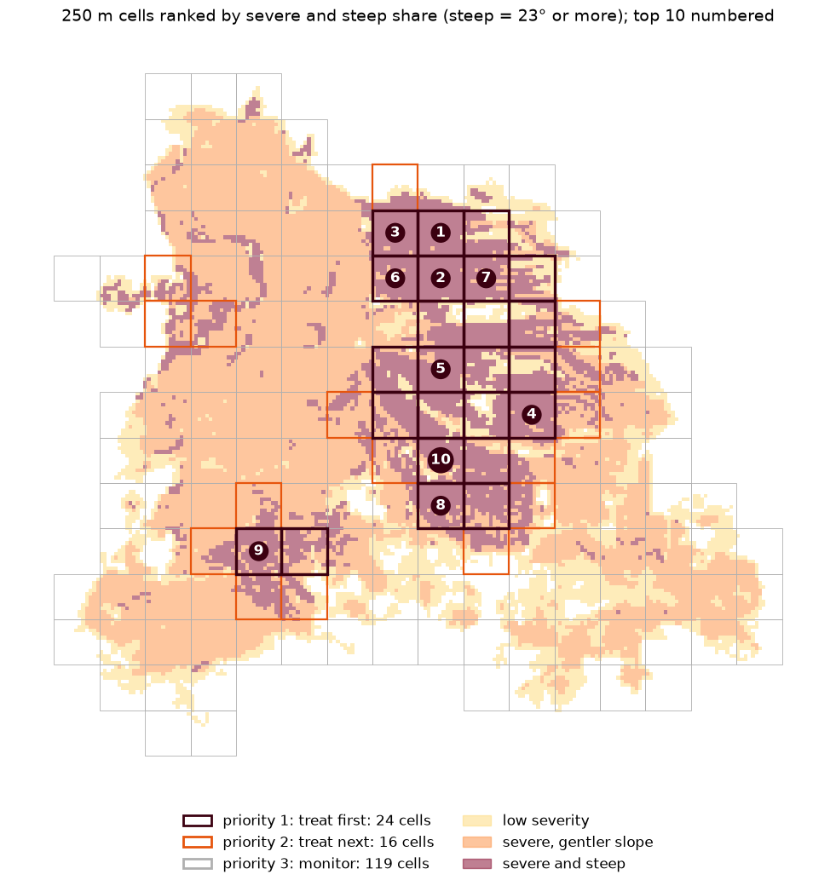

# Burn severity and erosion priority after the Vesuvius fire of August 2025

A Sentinel-2 pipeline in one Jupyter notebook: it maps how badly the fire of August 2025 burned the south-east flank of Vesuvius, adds slope, and ranks where the park authority and Campania civil protection should act first against erosion and debris flows before the autumn rains.

[](https://colab.research.google.com/github/Black-Lights/vesuvius-burn-severity/blob/main/vesuvius_burn_severity.ipynb)



## The answer

| | |
|---|---|
| Burned, main fire | 737 ha (EFFIS: 753 ha, intersection over union 0.85) |
| Moderate or high severity | 576 ha |
| Of that, 23° or steeper | 177 ha |
| Treat first: 250 m cells at least half severe and steep | 24 cells, 110 ha |
| Treat next: a quarter to a half | 16 cells, 35 ha |
| First list at a 20° or 26° limit | 24 or 19 of the 24 cells stay |

The notebook ends step 9 with a plain-language summary written by the code from these numbers.

## Run it

**Colab.** Open the badge above and run all cells. The first code cell clones this repository and installs its package.

**Locally**, with Python 3.12 and git:

1. The code and an environment.

   ```bash
   git clone https://github.com/Black-Lights/vesuvius-burn-severity
   cd vesuvius-burn-severity
   python -m venv .venv
   source .venv/bin/activate      # Windows: .venv\Scripts\activate
   ```

2. The notebook. This is all the core needs.

   ```bash
   pip install -r requirements.txt -r requirements-jupyter.txt
   pip install -e .
   jupyter lab vesuvius_burn_severity.ipynb
   ```

   The first run downloads the Sentinel-2 pixels from Microsoft Planetary Computer, a few minutes; later runs read the cache in `data/cache/`. No account or API key is needed. `requirements.lock.txt` pins the exact versions used.

3. Bonus A live, optional: the MCP server and the agent, with a key for one model.

   ```bash
   pip install -r requirements-agent.txt
   cp .env.example .env           # then set LLM_PROVIDER and that provider's key
   ```

4. Bonus B live, optional: the foundation models. torch first, from the index that matches the machine, then TerraTorch.

   ```bash
   pip install torch torchvision --index-url https://download.pytorch.org/whl/cu126   # CPU only: .../whl/cpu
   pip install -r requirements-gfm.txt
   ```

   The first run downloads the Prithvi weights (1.3 GB) from Hugging Face into its cache. A GPU is optional: one image takes under a second on a 6 GB laptop GPU and about 4 s on a CPU.

5. The checks.

   ```bash
   pip install -r requirements-dev.txt
   ruff check .
   pytest
   ```

Steps 3 and 4 are optional: without them the notebook still runs top to bottom, and the bonus cells read the results saved in `outputs/` by the last live run.

## What is where

| Notebook section | Code |
|---|---|
| 1. Settings, each with its reason | `src/burnsev/aoi.py` |
| 2. STAC search, scene table | `src/burnsev/catalog.py` |
| 3. Pixels, cloud mask, reflectance | `src/burnsev/ingest.py` |
| 4. True-colour and short-wave infrared pictures | `src/burnsev/plots.py` |
| 5. NBR and NDVI per date, window medians, dNBR, time series | `src/burnsev/indices.py` |
| 6. Severity classes, main fire | `src/burnsev/indices.py` |
| 7. Check against the EFFIS perimeter | `src/burnsev/reference.py` |
| 8. TINITALY 10 m elevation, slope | `src/burnsev/terrain.py` |
| 9. The decision: ranked cells, sensitivity, summary | `src/burnsev/decision.py` |
| 10. Files written and checked, interactive map | `src/burnsev/export.py` |
| 11. Limitations and next steps | notebook only |
| Bonus A. The pipeline as MCP tools, and an agent | `servers/burn_severity/`, `src/burnsev/api.py`, `agent/` |
| Bonus B. Prithvi-EO-2.0 burn scars against dNBR | `src/burnsev/prithvi.py` |

The notebook shows the source of the functions that carry the science next to the cells that call them.

## Outputs

In `outputs/`, all reopened and checked by the notebook:

- `dnbr_20m.tif`, `severity_20m.tif`: Cloud-Optimised GeoTIFF, EPSG:32633, 20 m. The severity raster carries its colour table.
- `main_fire_perimeter.geojson`, `priority_cells.geojson` (159 ranked cells), `alert_cells.geojson` (the 40 flagged cells): GeoJSON in longitude and latitude.
- `before_after.png`, `priority_map.png`.
- `agent_runs.json`, `agent_models.json`: the saved runs of bonus A (three conversations; one question to three models), replayed when no model key is set.
- `prithvi_burn_probability_20250806_30m.tif`, `prithvi_burn_probability_20250814_30m.tif`: bonus B, the burn-scar probability from Prithvi before and after the fire, in percent, COG at 30 m; read back when torch is not installed.

They open in QGIS by drag and drop; the GeoJSON files also open on [geojson.io](https://geojson.io).

## Checks

Every change went through a branch and a pull request. GitHub Actions runs ruff, 80 unit tests with no network (small synthetic arrays, fake EFFIS and STAC answers, the agent's graph with a scripted model, the Prithvi input and output handling without the model), a check that every notebook cell has been run, and the whole notebook on a clean Ubuntu machine that downloads the pixels itself.

## Bonus A: the pipeline as tools for a language model

- `servers/burn_severity/server.py` is an MCP server in the layout of the [EVE MCP tool registry](https://github.com/eve-esa/mcp-tool-registry) (FastMCP, `mcp[cli]==1.27.0`, stdio or HTTP) with four tools: `find_fires` (EFFIS burnt areas), `list_scenes` (Sentinel-2 scenes), `assess_burn` (steps 3 to 10 for any fire) and `vegetation_change` (median NDVI in two periods and where it dropped). The logic is in `src/burnsev/api.py`; on this notebook's box and dates `assess_burn` returns the notebook's numbers.
- `agent/` is a LangGraph agent with the loop of EVE's `ReactAgent` and a `verify` node that finds every number of the answer in the tool results. Answers are written for a non-specialist or a specialist, and a conversation keeps its earlier turns.
- The model is any chat model served in the OpenAI format, chosen in `.env` (see `.env.example`). DeepSeek V4.1 Flash, Kimi K3 and GPT-5.4 mini were tested. `LLM_PROVIDER=custom` points it at a self-hosted endpoint, such as EVE-Instruct behind an OpenAI-compatible server; that was not tested.

```bash
pip install -r requirements-agent.txt
python servers/burn_severity/test.py --quick     # the server alone: no model, no key
python -m agent.run "Which burned slopes of the Vesuvius fire of August 2025 should be treated first?" --reader public
python -m agent.chat                             # a conversation in the terminal
```

## Bonus B: geospatial foundation models

- `src/burnsev/prithvi.py` runs [Prithvi-EO-2.0-300M-BurnScars](https://huggingface.co/ibm-nasa-geospatial/Prithvi-EO-2.0-300M-BurnScars) (IBM and NASA) through TerraTorch on one Sentinel-2 image, averaged to the model's 30 m. On 14 August it calls 803 ha burned, 676 ha of them inside the dNBR main fire of 737 ha (IoU 0.78), and it finds nearly all of the moderate and high classes. A control on 6 August, before the fire, shows what one image cannot do: the model also calls the scars of the 2017 fires burned, which dNBR, measuring change, leaves out.
- TerraMind, for the land cover that band maths cannot give: next.

## Data and credits

- Sentinel-2 L2A: contains modified Copernicus Sentinel data 2025, through [Microsoft Planetary Computer](https://planetarycomputer.microsoft.com).
- Copernicus DEM GLO-30, used as the 30 m comparison: produced using Copernicus WorldDEM-30 © DLR e.V. 2010-2014 and © Airbus Defence and Space GmbH 2014-2018, provided under COPERNICUS by the European Union and ESA.
- TINITALY 1.1: Tarquini S., Isola I., Favalli M., Battistini A., Dotta G. (2023). TINITALY, a digital elevation model of Italy with a 10 meters cell size (Version 1.1). INGV. https://doi.org/10.13127/tinitaly/1.1. CC BY 4.0. A cut of the box is kept in `data/reference/`.
- Burnt-area polygons: [EFFIS](https://forest-fire.emergency.copernicus.eu), European Commission Joint Research Centre, fetched on 23 September 2026 and kept in `data/reference/`.
- Prithvi-EO-2.0-300M-BurnScars: IBM and NASA, Apache 2.0; Szwarcman et al. (2024), Prithvi-EO-2.0: A Versatile Multi-Temporal Foundation Model for Earth Observation Applications, arXiv:2412.02732.
- Method: Key and Benson (2006) for the dNBR classes; Staley et al. (2017) for the M1 terrain term; Horn (1981) for slope; Grohmann (2015) on resampling; Veraverbeke et al. (2010) on the post-fire window.

## Related

The EFFIS server in the [EVE MCP tool registry](https://github.com/eve-esa/mcp-tool-registry) returns fire statistics and plots at 100 m through the Copernicus Data Space Statistical API. This notebook works on the pixels and returns rasters, vectors and a decision.

## AI tools

Built with help from AI coding tools (Claude). Every line was read, run and checked, and each choice is explained in the notebook.
